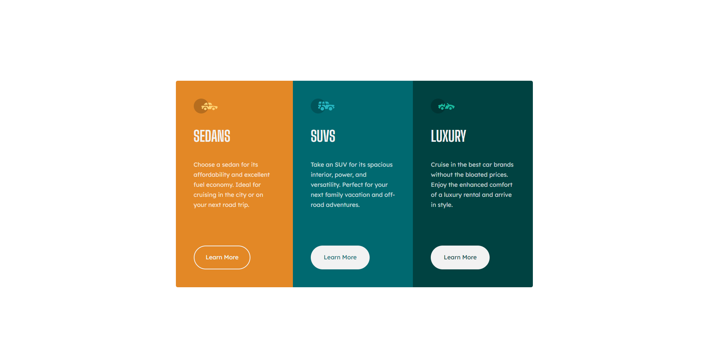

# Frontend Mentor - 3-column preview card component solution

This is a solution to the [3-column preview card component challenge on Frontend Mentor](https://www.frontendmentor.io/challenges/3column-preview-card-component-pH92eAR2-). Frontend Mentor challenges help you improve your coding skills by building realistic projects. 

## Table of contents

- [Overview](#overview)
  - [The challenge](#the-challenge)
  - [Screenshot](#screenshot)
  - [Links](#links)
- [My process](#my-process)
  - [Built with](#built-with)
  - [What I learned](#what-i-learned)
  - [Continued development](#continued-development)
  - [Useful resources](#useful-resources)
- [Author](#author)


## Overview

### The challenge

Users should be able to:

- View the optimal layout depending on their device's screen size
- See hover states for interactive elements

### Screenshot

#### Mobile


#### Desktop


#### Hover States


### Links

- Live Site URL: [https://playful-douhua-a4fbff.netlify.app/](https://playful-douhua-a4fbff.netlify.app/)

## My process

### Built with

- Semantic HTML5 markup
- CSS custom properties
- Flexbox
- Mobile-first workflow


### What I learned

I learned more about CSS pseudo-class and de @media property.

```css
.orange .btn:hover {
    background-color: var(--bright-orange);
}

.blue .btn:hover {
    background-color: var(--dark-cyan);
}

.green .btn:hover {
    background-color: var(--very-dark-cyan);
}

@media (min-width: 1200px) {
    body {
        display: flex;
        justify-content: center;
        align-items: center;
    }

    main {
        display: flex;
        max-width: 958px;
    }

    p {
        margin-bottom: 3rem;
    }

    section {
        display: grid;
        row-gap: 3rem;
    }

    .orange {
        border-radius: 5px 0 0 5px;
      }

    .green {
        border-radius: 0 5px 5px 0;
    }

    .btn {
        width: 70%;
    }

  }
```

### Continued development

Keep learning about CSS pseudo-class and working hard to make my skills better.

### Useful resources

- [Custom CSS Reset](https://www.joshwcomeau.com/css/custom-css-reset/)


## Author

- Frontend Mentor - [@brenobms97](https://www.frontendmentor.io/profile/brenobms97)

